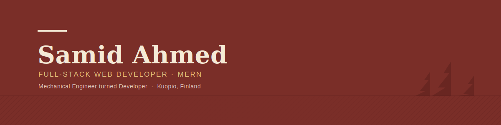

  

<h3 align="center">Full-Stack Web Developer (MERN) | Mechanical Engineer turned Developer</h3>

  📍 Kuopio, Finland &nbsp;|&nbsp; 🎓 Full-Stack Web Development Bootcamp, Programming Hero &nbsp;|&nbsp; 🔧 BSc Mechanical Engineering, Savonia UAS

  
  
  
  

---

### 🚀 About Me

- 🌱 Currently completing **Programming Hero's Full-Stack Web Development Bootcamp** (Batch-13)
- 💻 Building full-stack apps with the **MERN stack** — React, Node.js, Express, MongoDB
- 🔧 Background in **Mechanical Engineering**, now applying that same problem-solving mindset to software
- 🌍 Based in Kuopio, Finland — building my Finnish alongside my code
- ⚡ Fun fact: I also spend time traveling, running, swimming, and shooting videography on the side

---

### 🛠️ Tech Stack

  
  
  
  
  
  
  
  
  
  
  
  
  

---

### 📌 Featured Projects

**Donora** — Full-stack MERN blood donation platform
Express, MongoDB, JWT, Stripe backend · React, Vite, Tailwind v4 frontend
🔗 [Live](https://donora-client.vercel.app/) · [Client Repo](https://github.com/code-samid/Donora-client) · [Server Repo](https://github.com/code-samid/Donora-server) · [Server (Render)](https://donora-server.onrender.com)

**MediQueue** — Full-stack MERN tutor booking system
Firebase Auth + JWT, MongoDB, Express, React
🔗 [Live](https://mediqueue-client-omega.vercel.app/) · [Backend](https://mediqueue-server-f4dh.onrender.com)

**SkillSphere** — Next.js 16 learning platform
Better Auth, Turso/LibSQL, full auth flow & session handling
🔗 [Live](https://b13-a8-skillsphere.vercel.app/)

**KeenKeeper** — Friendship CRM
React, Vite, Recharts, DaisyUI, custom hooks & context-based state
🔗 [Live](https://b13-a7-keen-keeper-xi.vercel.app/) · [Repo](https://github.com/code-samid/B13-A7-keen-keeper)

> 👉 More details and case studies on my [portfolio](https://samid-ahmed-portfolio.netlify.app/)

---

### 📊 GitHub Stats

  
  

---

### 📬 Let's Connect

  <a href="https://www.linkedin.com/in/samidahmed?utm_source=share_via&utm_content=profile&utm_medium=member_ios" target="_blank">LinkedIn</a> &nbsp;•&nbsp;
  <a href="https://github.com/code-samid" target="_blank">GitHub</a> &nbsp;•&nbsp;
  <a href="https://samid-ahmed-portfolio.netlify.app/" target="_blank">Portfolio</a> &nbsp;•&nbsp;
  <a href="mailto:samid.ahmed1993@gmail.com">Email</a>

